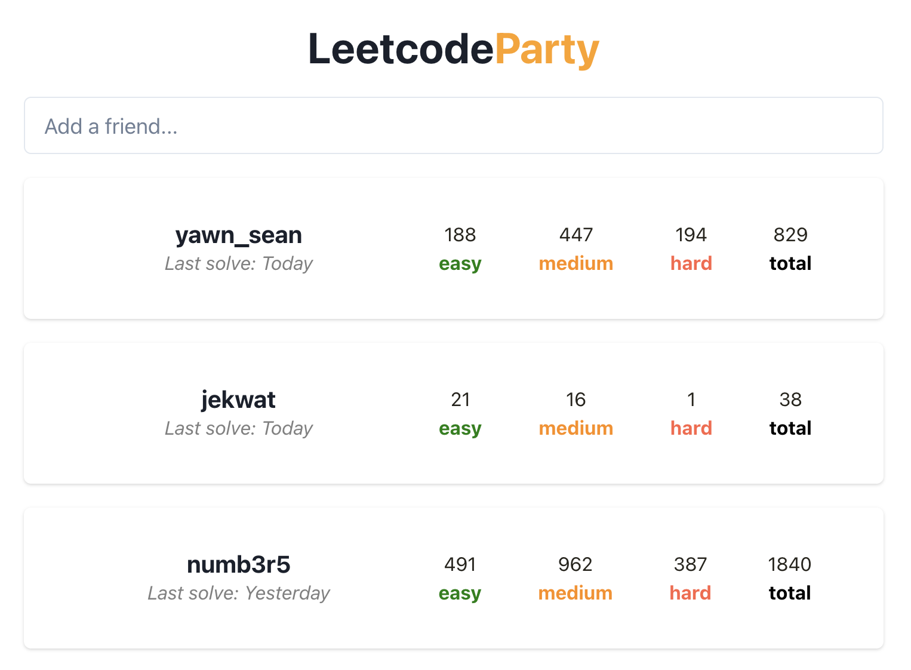

# LeetcodeParty

LeetcodeParty brings a social element to Leetcode – track your friends' progress and compete together.

View LeetcodeParty: [leetcodeparty.jackfwhite.com](https://leetcodeparty.jackfwhite.com/)



## Installation

To get started with this project, follow these steps:

1. Clone the repository:

```sh
git clone https://github.com/yourusername/leetcode-party.git
cd leetcode-party
```

2. Install dependencies:

```sh
npm install
```

## Usage

To start the development server, run:

```sh
npm run dev
```

This will launch the app in development mode. Open http://localhost:5173 to view it in your browser. The page will reload if you make edits.

To build the project for production, run:

```sh
npm run build
```

This will create an optimized production build of your app in the `dist` folder.

## Contributing

Contributions are welcome! Please open an issue or submit a pull request with any improvements or suggestions.

## License

This project is licensed under the MIT License.
